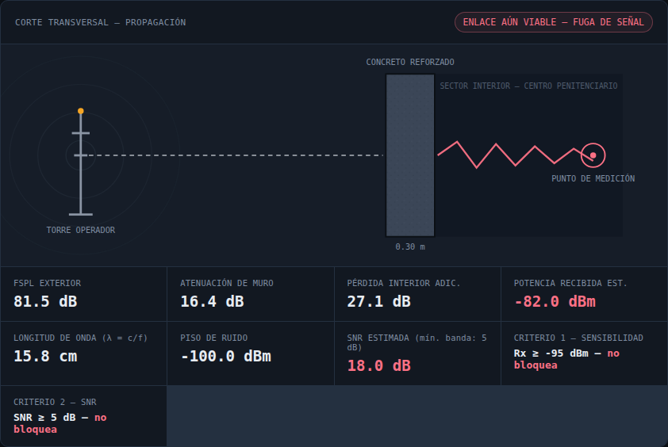
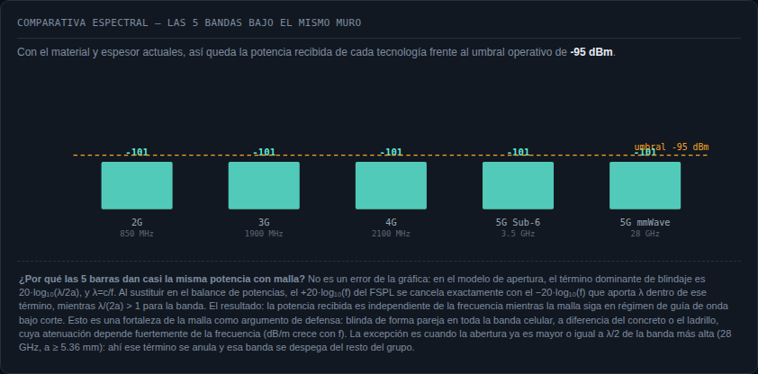
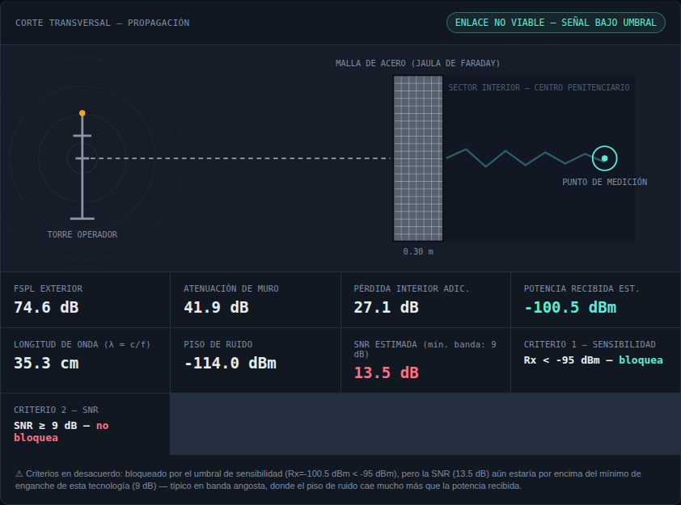
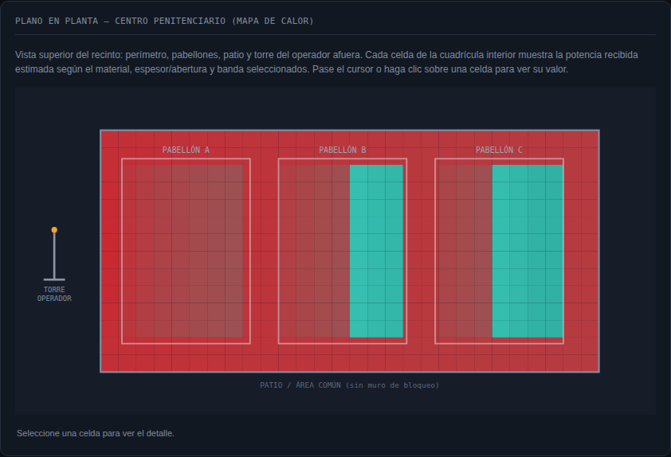
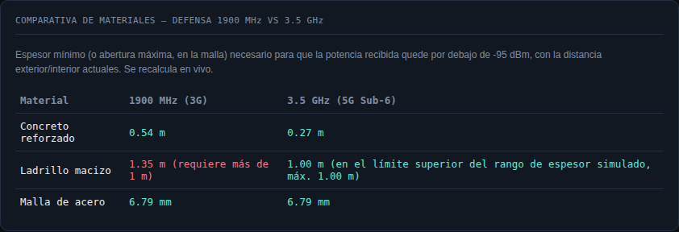

# Control Conceptual de Señales No Autorizadas en Centros Penitenciarios

Simulador web interactivo de **atenuación pasiva** de señal celular en centros
penitenciarios, desarrollado como proyecto del curso de Telecomunicaciones
(Universidad Mariano Gálvez de Guatemala). Modela, con las fórmulas de
ingeniería de RF reales, cómo el material y el espesor de un muro —o la
abertura de una malla metálica— pueden degradar una señal celular hasta
dejarla por debajo del umbral operativo, **sin emitir ninguna frecuencia**
(a diferencia de un inhibidor/jammer activo, que es ilegal en Guatemala bajo
el Decreto 94-96, Ley General de Telecomunicaciones, y las normativas de la
Superintendencia de Telecomunicaciones — SIT).

**Sitio en vivo:** https://giancarlo232.github.io/control-senales-penitenciarias/
**Repositorio:** https://github.com/Giancarlo232/control-senales-penitenciarias

## Qué hace el simulador

- Compara 5 bandas celulares: 2G (850 MHz), 3G (1900 MHz), 4G (2100 MHz),
  5G Sub-6 (3.5 GHz) y 5G mmWave (28 GHz).
- Compara 3 materiales de muro: concreto reforzado, ladrillo macizo y malla
  de acero (jaula de Faraday).
- Calcula, en tiempo real, la pérdida de espacio libre (FSPL), la atenuación
  del muro, la pérdida interior adicional, la potencia recibida, el piso de
  ruido y la SNR resultante.
- Muestra un corte transversal de la propagación, una gráfica comparativa de
  las 5 bandas, una gráfica de FSPL vs. distancia, un plano en planta con
  mapa de calor interactivo, y una tabla comparativa de materiales para la
  defensa técnica (1900 MHz vs. 3.5 GHz).

## Fórmulas utilizadas

**Pérdida de espacio libre (FSPL, SI):**

```
FSPL(dB) = 20·log10(d) + 20·log10(f) − 147.55
```
`d` en metros, `f` en Hz.

**Balance de potencias:**

```
Potencia_recibida = EIRP − FSPL_exterior − Atenuación_muro − Pérdida_interior
```

**Atenuación dieléctrica del concreto y el ladrillo (UIT-R P.2040,
materiales de baja pérdida):**

```
sigma = c · f_GHz^d
alfa(dB/m) ≈ 1636 · sigma / sqrt(eps')
```

**Efectividad de blindaje de la malla de acero (modelo de apertura —
guía de onda bajo corte + reflexiones múltiples):**

```
SE(dB) = max(0, 20·log10(lambda / (2a))) + 27.3 · (t / a)
```
`lambda = c/f`, `a` = abertura de la malla, `t` = grosor del alambre
(ambas en mm). A diferencia de un material dieléctrico, la malla protege
**mejor a baja frecuencia y peor a alta frecuencia**, y su efectividad no
depende del espesor del muro.

**Piso de ruido y SNR:**

```
Piso_de_ruido(dBm) = −174 + 10·log10(BW_Hz) + NF
SNR(dB) = Potencia_recibida − Piso_de_ruido
```
con NF = 7 dB y ancho de banda (BW) específico por tecnología.

## Tabla de coeficientes de atenuación dieléctrica

Calculados en el propio código con la fórmula de UIT-R P.2040 (no son
valores escritos a mano). Fuente: Recomendación UIT-R P.2040, "Effects of
building materials and structures on radiowave propagation above about
100 MHz" (parámetros ε′, c, d por material).

| Material | ε′ | c | d | Rango válido | 850 MHz* | 1900 MHz | 2100 MHz | 3.5 GHz | 28 GHz |
|---|---|---|---|---|---|---|---|---|---|
| Concreto reforzado | 5.24 | 0.0462 | 0.7822 | 1–100 GHz | ~29 dB/m | ~55 dB/m | ~59 dB/m | ~88 dB/m | ~447 dB/m |
| Ladrillo macizo | 3.91 | 0.0238 | 0.16 | 1–40 GHz | ~19 dB/m | ~22 dB/m | ~22 dB/m | ~24 dB/m | ~34 dB/m |

\* 850 MHz está fuera del rango de validación de la norma (que inicia en
1 GHz); el simulador lo marca como extrapolación.

Ambos coeficientes se limitan a un tope práctico de saturación (concreto
200 dB, ladrillo 160 dB). **Ese tope no es un límite de la absorción
dieléctrica** (esa sigue creciendo con el espesor): representa el piso
práctico que imponen las **trayectorias de flanqueo** del muro —puertas,
ventanas, ductos de ventilación, juntas constructivas y difracción de la
señal por encima o alrededor del muro—, que dominan la fuga real una vez
que la trayectoria directa a través del material ya está muy atenuada. El
ruido térmico del receptor no limita cuánto atenúa un muro; solo define el
piso de ruido con el que se compara la señal (ver SNR más abajo). Por eso
el tope se expresa en **dB de atenuación total**, no en dB/m: el
coeficiente por metro de la tabla y el tope se alcanzan a espesores muy
distintos según el material y la banda, por ejemplo:

| Material | Banda | Coeficiente | Espesor al que se alcanza el tope |
|---|---|---|---|
| Concreto (tope 200 dB) | 850 MHz | ~29 dB/m | ~6.9 m |
| Concreto (tope 200 dB) | 28 GHz | ~447 dB/m | ~0.45 m |
| Ladrillo (tope 160 dB) | 850 MHz | ~19 dB/m | ~8.3 m |
| Ladrillo (tope 160 dB) | 28 GHz | ~34 dB/m | ~4.8 m |

La malla de acero **no** usa esta tabla: se modela por separado con el
modelo de apertura descrito arriba, con un tope práctico de 100 dB.

## Por qué la malla da (casi) la misma potencia en las 5 bandas

Con malla, las 5 bandas dan una potencia recibida prácticamente idéntica
para una misma abertura (por ejemplo, -100.5 dBm con a = 5 mm, 150 m de
antena externa y 8 m de profundidad interior). **No es un error del
simulador.** En `SE(dB) = max(0, 20·log10(λ/2a)) + 27.3·(t/a)`, con
`λ = c/f`, el término `20·log10(λ)` se puede expandir como
`20·log10(c) − 20·log10(f)`. Ese `−20·log10(f)` cancela exactamente el
`+20·log10(f)` que aporta el FSPL en el balance de potencias, siempre que
`λ/(2a) > 1`. El resultado: **la potencia recibida es independiente de la
frecuencia** mientras la malla siga en régimen de guía de onda bajo corte.

Esto es, de hecho, un argumento de defensa a favor de la malla: **blinda
de forma pareja en toda la banda celular**, mientras que el concreto y el
ladrillo dependen fuertemente de la frecuencia (su coeficiente en dB/m
crece con `f`, como muestra la tabla anterior). La excepción aparece
cuando la abertura ya es mayor o igual a `λ/2` de la banda más alta
(28 GHz, `a ≥ 5.36 mm`): ahí el término `20·log10(λ/2a)` se anula y esa
banda se despega del resto del grupo, como se ve en la segunda captura de
la sección siguiente.

## Dos criterios de bloqueo, no uno

La interfaz muestra dos criterios en paralelo, porque pueden discrepar:

1. **Umbral de sensibilidad:** `Rx < -95 dBm` — el criterio de la guía del
   curso, que ya incorpora de fábrica una SNR mínima típica de enganche.
2. **SNR mínima explícita:** `SNR < SNR_mín`, con `SNR_mín` por tecnología
   (2G 9 dB, 3G 5 dB, 4G 2 dB, 5G Sub-6 y mmWave 0 dB), usada también como
   pivote de color de la SNR en vez de un 0 dB arbitrario.

Ambos criterios suelen coincidir, pero pueden discrepar en **banda
angosta**: un ancho de banda pequeño implica un piso de ruido muy bajo
(`piso = -174 + 10·log10(BW) + NF`), así que la SNR puede seguir siendo
alta aunque la potencia absoluta ya esté bajo -95 dBm. Esto ocurre, por
ejemplo, con 2G bajo malla: Rx = -100.5 dBm (bloqueado por sensibilidad)
pero SNR = +13.5 dB, muy por encima del mínimo de 9 dB de 2G. Cuando los
criterios discrepan, la interfaz lo declara explícitamente (ver tercera
captura) en vez de mostrar solo el criterio 1.

## Capturas

**Corte transversal con los dos criterios de bloqueo** (concreto, 1900 MHz):



**Planitud espectral de la malla** — las 5 bandas caen en la misma barra:



**Desacuerdo entre criterios** (malla, 850 MHz): bloqueado por sensibilidad
pero con SNR aún favorable:



**Plano en planta con mapa de calor** (perímetro, pabellones, patio y torre):



**Tabla comparativa de materiales**, con las notas de rango simulado:



## Cómo ejecutarlo

Es una sola página HTML5 + CSS3 + JavaScript vanilla, sin dependencias de
build ni frameworks:

1. Clonar el repositorio o descargar `index.html`.
2. Abrirlo directamente en cualquier navegador moderno (doble clic, o
   `open index.html` / arrastrarlo a la ventana del navegador).
3. También está publicado en GitHub Pages, sin necesidad de instalar nada:
   https://giancarlo232.github.io/control-senales-penitenciarias/

## Alcance y limitaciones

Proyecto estrictamente de **control pasivo**: no construye, simula ni emite
ninguna interferencia activa. El modelo del muro es una simplificación de
ingeniería con fines pedagógicos (pérdida interior con exponente n=3
independiente de la frecuencia, EIRP configurable, distancias de línea
recta) y no reemplaza un estudio de propagación en sitio. En el plano en
planta, el patio/área común dentro del perímetro (sin muro) se modela con
un exponente n=2 y una profundidad efectiva `distIntM/2`: son supuestos de
trazado para ilustrar el contraste patio-vs-pabellón, no mediciones de
campo.

## Autor

Douglas Giancarlo Gutiérrez Morataya — carné 0900-22-5347
Curso de Telecomunicaciones, Universidad Mariano Gálvez de Guatemala
